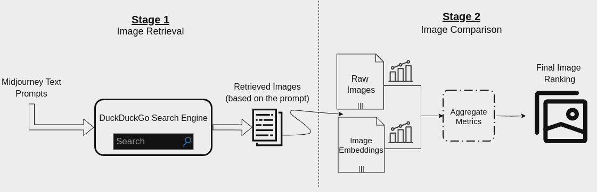
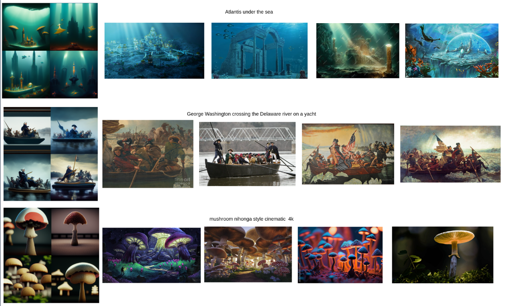

# DuckDuckGo Experiments
Here is the code for the experiments with DuckDuckGo search engine.
For each of our prompts we downloaded 30 images using the API of DDG and we saved  each set of images with the relevant generated images from Midjourney Datase in folders in order to compare them and extract similarities metrics.

Our experiments can be depicted in the following figure.

To run the DDG experiment first you have to create the API calls and save the downladed images in a proper way so as to enable comparisons with the generated image.

Data, image_list and prompts csv files contains all the information for the Midjourney dataset.

Some Examples of the DuckDuckGo experiments can be seen in the following figure.

More example with their ranking can be found in the  folder large_scale_examples. 

