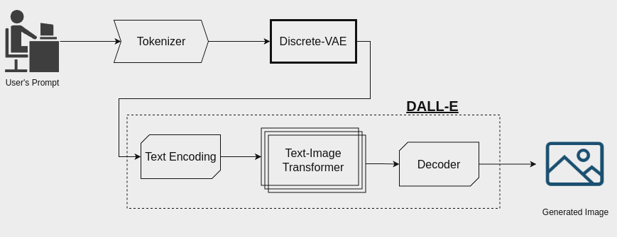
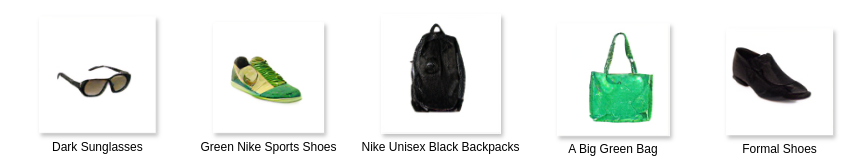

# Local Model
## Install

More information about the local model can be found in the following link:[Dalle-pytorch](https://github.com/lucidrains/DALLE-pytorch#install)

```python
$ pip install dalle-pytorch
```

The architecture of the local model can be visualised in the following figure:


We trained the model using a dataset with fashion items. We trained it with the following parameters:
epochs: 30, batch_size: 5, learning_rate: 4.5e-4, depth: 16, heads: 12, head_dimension: 64.
For our trainings we used 2 GeForce GTX 1080 Ti GPUs with 11 GB RAM.
 
The fashion dataset we used can be downloaded from this [Kaggle link](https://www.kaggle.com/datasets/paramaggarwal/fashion-product-images-dataset)

**common_words.txt:** Is a list with the most commonly found words in the descriptions. They were found using  **find_common_words.py**

**local_generations:** Contains some of the local generations used for the experiments.

**outputs:** There will be saved all the generations you will make.

**fashion_16_12_30ep.pt:** Is the model we trained to generate fashion items.  [Model](https://www.dropbox.com/scl/fi/1gwxexppp4vbbe7aqr8nj/fashion_16_12_30ep.pt?rlkey=rp2o2lnr29pmq3vo3uj7fi1v8&st=qat5dlwz&dl=0)

To generate a set of images run the following:
```
$ python3 generate.py --dalle_path ./fashion_16_12_30ep.pt --text 'Ray-Ban Adults-Men Metallic Fashion Winter 2016 Casual Sunglasses'
```


**train_dalle.py:** Is the file you use to train your own model.

**generate.py:** Is the file you use to generate images with your own prompts.

**config.yaml:** Configuration file to train dalle-pytorch.

**config1.yaml:** Configuration file to retrain dalle-pytorch for unlearning.

Some of our generations in our local model can be seen in the following figure.

