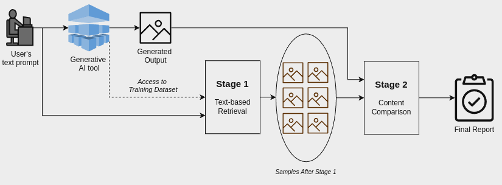

# Enhancing Interpretability in Generative AI Through Search-Based Data Influence Analysis
**Abstract:** Generative AI models offer powerful capabilities but often lack transparency, making it difficult to understand their outputs. This is critical in cases involving artistic or copyrighted content. This work introduces a search-inspired approach to improve the interpretability of these models by analysing the influence of training data on their outputs. Our method provides observational interpretability by focusing on the model’s outputs rather than its internal state. We consider both raw data and latent-space embeddings when searching for the influence of data items in generated content. We evaluate our method by retraining local models, demonstrating its ability to uncover influential subsets in the training data. This work lays the groundwork for future extensions, including user-based evaluations with domain experts, contributing to improved observational interpretability.

**Keywords:** Observational Influence Analysis, Information Retrieval, Generative AI, Copyright Violation, Unlearning.

Our Proposed Method can be depicted in the following figure.

# Train a generative model locally:
In order to train and use a local model for our generations we used the [Dalle-pytorch](https://github.com/lucidrains/DALLE-pytorch) package. It is an implementation of [DALL-E](https://openai.com/blog/dall-e/) ([paper](https://arxiv.org/abs/2102.12092)), OpenAI's Text to Image Transformer, in Pytorch.

