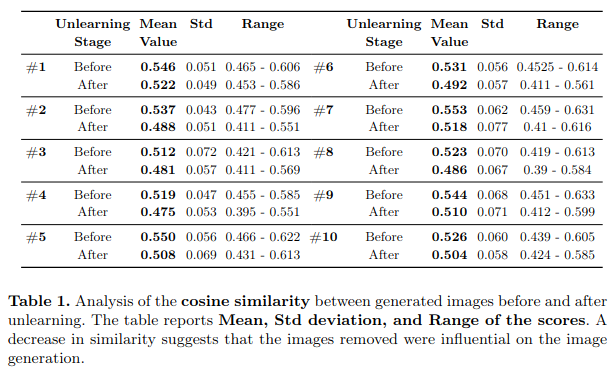

# Unlearning
Here is the code we used to unlearn some of the training samples in order to retrain and see the differences.

The image provides a simple example of how we identify the most common images for unlearning, focusing on those that most influence the model's outputs:

All the selected prompts for the Unlearning experiments are in the folder **descriptions**. Each time we unlearn 10 images for each text prompt (150 image-descriptions pairs).

**main_experiment.py:** Make the initial generations and organize the images in folders. Retrieve the most similar images (100 images) based on text.

**raw_image_similarity.py:** Compare raw images and extract metrics.

**compare_embeddings.py:** Extract embeddings from ResNet50 for all the images and extract metrics.

**create_ranking.py:** Combine metrics produced from raw_image_similarity.py and compare_embeddings.py in order to rank the images.

**remove_from_dataset.py:** Remove the images and their descriptions from the dataset according to the ranking.

**regenerate_images.py:** Regenerate after having removed the selected images.

To evaluate the success of the Unlearning we tried to compare the images before and after removing the selected images.

**metrics_after_unlearning:** Contains all the csv files with the metrics for each set of experiments.

**compare_after_unlearning.py:** Compare the embeddings of the 2 sets of images (before and after unlearning) so as to extract the metrics.
 
The results (metrics) for the unlearning procedure with some of the images generated are placed in ./metrics_after_unlearning and can be seen in the following table:

